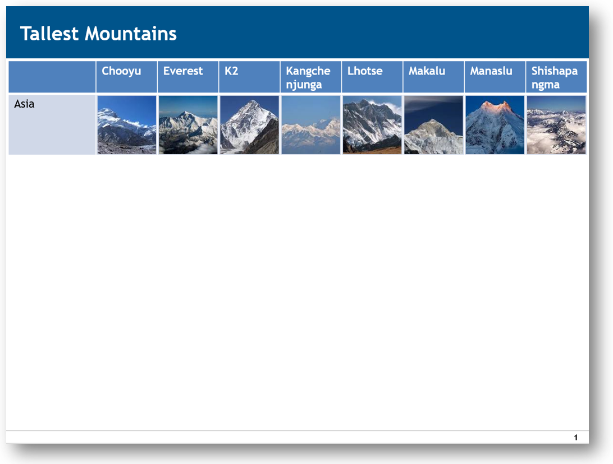

# Assembling data images into PowerPoint slides using python-pptx

## Introduction

As an engineer, I have to present data daily to a broad audience.  PowerPoint is usually the tool of choice at companies.  When I conduct a series of design of experiments (DOE), I often summarize the data results into a table to aid comparison.  On a typical day, I may need to organize 10-20 data images into tables.  On a busy day, the number of images can be as high as 100, which means 3-4 hours of mousing around.  Luckily, my experimental data are stored in structured directories, and I was able to automate the tasks of assembling data images into PowerPoint slides using [python-pptx](https://github.com/scanny/python-pptx).  pptxGen.py loops over a structured directory of images and uses filenames to identify where each image should go inside the table in the PowerPoint presentation.  This script had saved me over 10 hours in the first week that it was written.  I hope that you may find pptxGen.py useful as a starting point for your adventure with PowerPoint automation!

## Usage
1. Save the desired PowerPoint template (.potx) file as template.pptx with all the slides deleted
1. Create the directory structure below
1. Run pptxGen.py

```
    Data
    |--- Sample A
    |    |--- Loc_1
    |    |--- Loc_2
    |    |--- Loc_3
    |    |--- Loc_4
    |    |--- Loc_5
    |    ...
    |--- Sample B
    |    |--- Loc_1
    |    |--- Loc_2
    |    ...
    ...
```

Below is an example screenshot showing the final output PowerPoint slide with data images organized in a table.  For illustration purposes, actual data have been replaced by photos of tall mountains.



## Disclaimer
pptxGen.py was shared for educational purposes only.